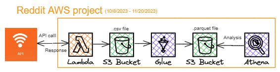

## Overview
This repository describes simple demo ELT pipeline projects. All of them:
  - are orchestrated by Airflow, so the DAG python file is the controlling code.
  - use AWS services (Lambda, S3, and Glue)
  - require AWS keys to operate.
  - those with API calls probably require a current API key.

## Reddit pipeline 

Note that the AWS services are being orchastrated by Airflow, using operator calls. Athena is not invoked by Airflow, that symbol simple indicates one could use it to make a quick analyze. In a production environment, it's more likely the S3 parquet file would go into Redshift, via another Glue job if necessary. 